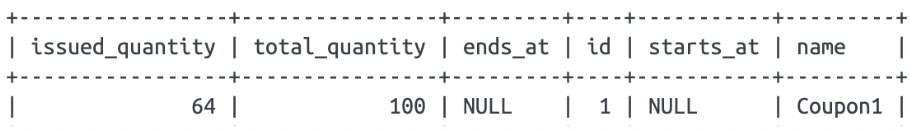
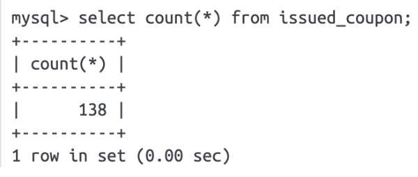
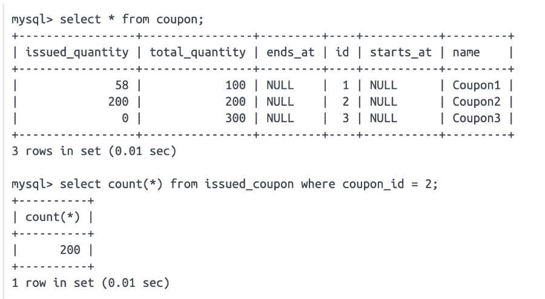

# Limited-quantity-coupon-drop
선착순 쿠폰 발급 시뮬레이션 프로젝트

## 아키텍처 및 기술 스택
프로젝트는 총 3단계의 아키텍처 개선 과정을 통해 완성됩니다. 각 단계에서 서로 다른 기술을 적용하여 문제점을 해결하고 성능을 최적화합니다.

### 1단계: 동시성 문제 해결 (데이터베이스 락)
📌 문제 발견 및 분석

문제점: 여러 요청이 동시에 데이터베이스의 issued_quantity를 업데이트할 때, 경쟁 상태(Race Condition)가 발생하여 데이터 불일치가 일어납니다.

 문제점                           | 원인                                                     | 결과 | 
| :--- | :--- | :--- |
| 쿠폰 발급 수량 불일치 (Race Condition) | 여러 요청이 동시에 재고를 읽고 업데이트하여 총 수량(Total Quantity)을 초과하여 발급 | 데이터 정합성 회손 |
| 데드락(Dead Lock) 발생                       | 락 순서 오류 등으로 트랜잭션들이 서로 자원을 기다리는 비정상적인 교착 상태 발생 (오류율 99.5% 확인) | 시스템 비정상 종료 및 안정성 저해.|

💡 해결책: JPA 비관적 락 (Pessimistic Lock) 적용

원리: SELECT FOR UPDATE를 사용하여 쿠폰 레코드에 대한 독점적인 잠금을 설정합니다. 재고 조회 시점부터 발급 완료 시점까지 다른 트랜잭션의 접근을 막아 데이터 정합성을 완벽하게 보장했습니다.
결과: 동시성 문제와 데이터 불일치 문제를 해결했으나, 모든 요청이 DB 락에 의해 직렬화되어 대기하면서 과부하 시 성능 저하라는 새로운 병목 현상이 발생했습니다.

### 2단계: 선착순 발급 구현 (Redis Sorted Set)

문제점: 락을 사용하면 동시성 문제는 해결되지만, 요청이 순서대로 처리되면서 과부하 시 성능이 저하됩니다. 또한, 요청이 들어온 순서대로 100명에게만 발급되는 공정성을 보장하기 어렵습니다.

 문제점        | 목표                                                          |  
|:-----------|:------------------------------------------------------------| 
| 성능 저하      | 1단계의 DB 락으로 인해 요청이 순서대로 처리되어 시스템 처리량(Throughput)이 급감한 문제 해결 |
| 선착순 공정성 확보 | 요청이 들어온 순서대로 정확하게 N명에게만 발급되는 공정성 보장. |

- 해결책: Redis Sorted Set을 사용하여 요청 순서대로 유저를 기록하고, 선착순 100명만 쿠폰 발급 로직을 진행하도록 제어합니다.

    - 원리: DB 락 대신 Redis를 선착순 관문으로 사용합니다.

        1. 선착순 등록: 요청 시 현재 타임스탬프를 Score로 하여 Sorted Set (ZSET)에 userId를 등록하여 요청 순서를 보장합니다.

        2. 빠른 마감 (Fail Fast): ZCARD 명령으로 ZSET의 현재 크기를 확인하여 한정 수량(N)을 초과하면 즉시 실패 처리하여 DB 접근을 차단합니다.

        3. 중복 방지: 발급 완료된 userId는 별도의 Redis Set에 기록하여 다음 요청부터는 O(1)로 중복 검사를 처리합니다.

결과: DB 부하를 Redis의 인메모리 연산으로 대체하여 성능을 개선하고, 타임스탬프를 통한 공정한 선착순을 구현했습니다. 다만, 여전히 성공 요청이 DB 트랜잭션에 직접적인 부하를 주어 커넥션 풀 고갈 위험이 남아있습니다.

### 3단계: 대용량 트래픽 처리 (메시지 큐)

문제점: 여전히 많은 요청이 데이터베이스에 직접 부하를 주면서 커넥션 풀 고갈 문제가 발생할 수 있습니다.

해결책: 메시지 큐(Message Queue)를 도입하여 모든 쿠폰 발급 요청을 비동기적으로 처리합니다. 요청은 큐에 쌓이고, 별도의 워커가 순차적으로 데이터를 처리하여 데이터베이스의 부하를 분산시킵니다.

